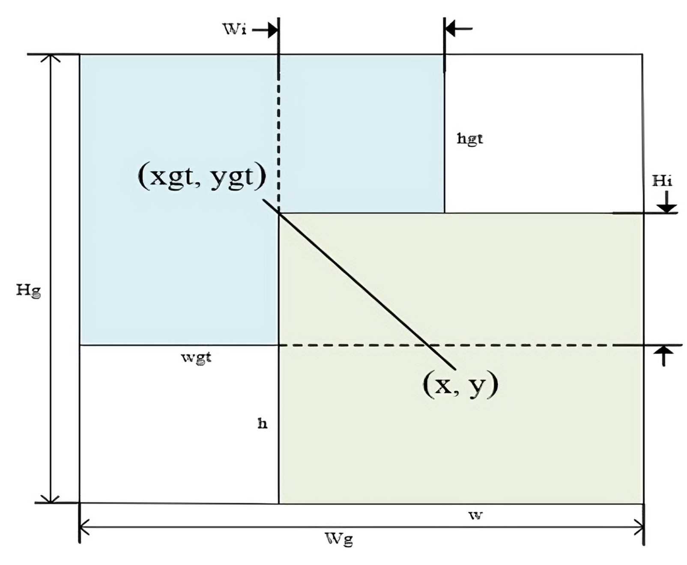

# Personal Protective Equipment detection using YOLOv8 with Global Attention Mechanism and Dynamic Focus Mechanism (Status: Submission)

## Introduction

 
This paper proposes the Personal Protective Equipment (PPE) detection algorithm based on an improved YOLOv8s model to address these issues. Firstly, an improved Global Attention Mechanism (iGAM) is introduced based on the original Global Attention Mechanism (GAM) to achieve a larger receptive field for aggregating data while reducing computational costs. This module is integrated into the Head part of YOLOv8s. Secondly, the bounding box regression loss with a dynamic focus mechanism decreases the harmful gradient generated by low-quality samples. The proposed model was trained on the Colors Helmet and Vest (CHV) dataset. Experimental results demonstrate that the proposed algorithm achieved a mAP@50 and mAP@50-95 outperformed original YOLOv8s by 1.3% and 3% respectively. Furthermore, the algorithm was successfully deployed on the Jetson Orin Nano kit, achieving a processing speed of 30 frames per second (FPS), making it appropriate for real-time applications.

## Proposed improved Yolov8 's Architecture

  

## Proposed I-GAM Architecture with fine-tunning AND H-swish activation function

## Wise IoUv3

 
In the object detection task, the bounding box loss function is the most important. The role of the bounding box loss function is to minimize the difference between the detection box and the ground truth box to achieve the best score of precision in object detection. This paper proposes replacing the CIoU loss function used in YOLOv8 with the WIoUv3 [37] loss function to enhance the model’s performance. The WIoUv3 loss function is introduced by Tong et al to improve the accuracy of bounding box regression and increase the convergence rate. This loss function features two layers of attention and a dynamic non-monotonic focusing mechanism. 
The dynamic non-monotonic FM and two layers of attention use the outlier degree instead of IoU to evaluate the quality of anchor boxes and provide a gradient gain allocation strategy.
This strategy lowers the influence of high-quality anchor boxes in competition while simultaneously reducing the negative gradient impact caused by low-quality examples [38].

  

## Color Helmet and Vest (CHV)  Dataset

In our experiment, we used dataset **Color Helmet and Vest (CHV)**,which is pushlised by Wang et al. These are contained 1330 images, and 9209 instances in total.

The dataset is open for free use, raw data download at (https://github.com/ZijianWang-ZW/PPE_detection) or data which already processed (https://universe.roboflow.com/hienlongairesearch/chv_dataset_officially ). 

## Results

- **Ablation Experiments.**

Figure: Ablation Experiments.

  

- **Comparision result with other methods.**

Figure: Comparision Results.

  

- **Detection.**

Figure: Original method.

  

Figure: Proposed method.

  

- **System implementation on Jetson Orin Nano.**

  

  

The full Demo is published at : https://www.youtube.com/watch?v=8uXFvbUzbX8

## Citation
	
`P. H. Long and T. Q. Vinh `

